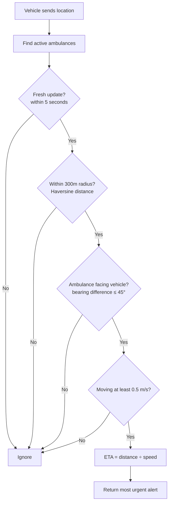

```mermaid
flowchart TD
  A["Vehicle sends location"] --> B["Find active ambulances"]
  B --> C{"Fresh update?<br/>within 5 seconds"}
  C -- No --> X["Ignore"]
  C -- Yes --> D{"Within 300m radius?<br/>Haversine distance"}
  D -- No --> X
  D -- Yes --> E{"Ambulance facing vehicle?<br/>bearing difference ≤ 45°"}
  E -- No --> X
  E -- Yes --> F{"Moving at least 0.5 m/s?"}
  F -- No --> X
  F -- Yes --> G["ETA = distance ÷ speed"]
  G --> H["Return most urgent alert"]
```
